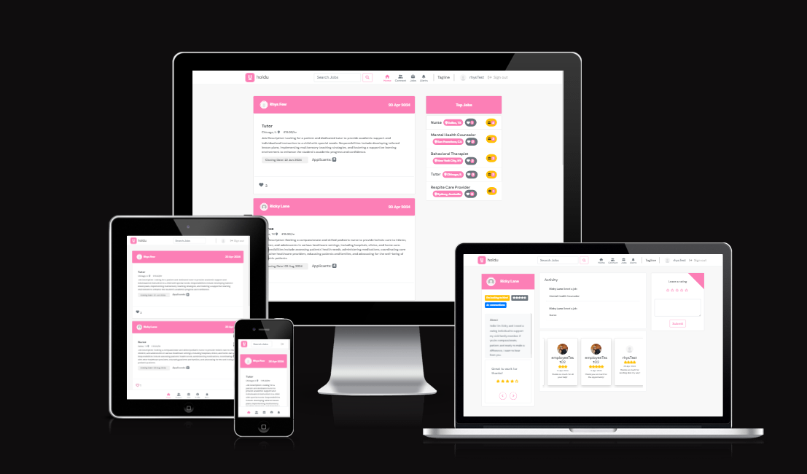
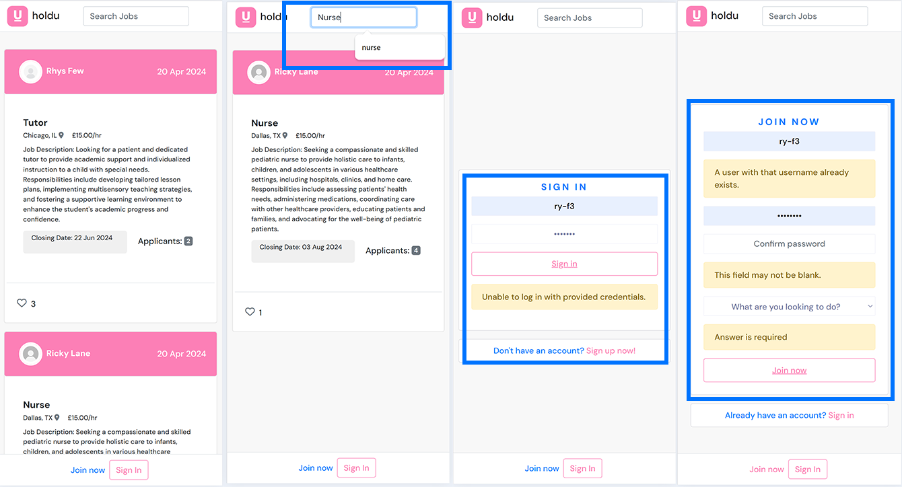
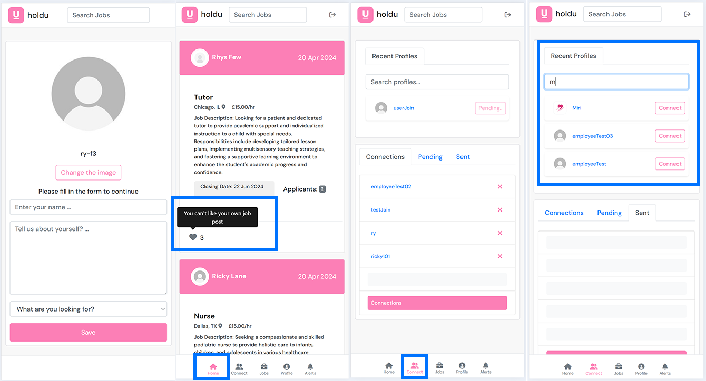
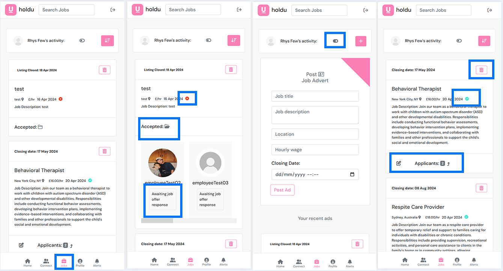
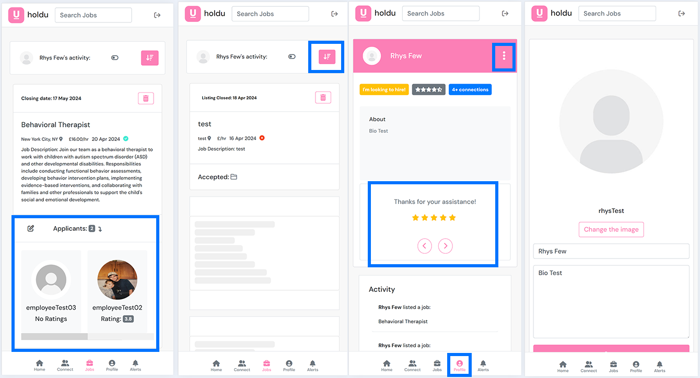
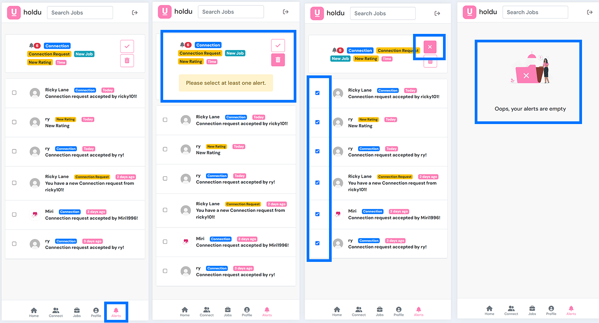

# Holdu
## React FrontEnd: Job Application Platform

*The deployed application link can be found here: [Holdu](https://hold-u-c52c62c74dca.herokuapp.com/)*

*Backend repository link can be found here: [link](https://github.com/Ry-F3/holdu-drf-api)*

## Key Features:

## Mobile first design

#### Employer Profile

Workflow board [1]

Details [1]

 

* **User Authentication:**
    * Unauthenticated users are directed to the home page where they can browse job listings.
    * To interact with job listings, users must either join or sign in if they are returning users.
* **Navigation Bar:**
    * The navigation bar provides easy access for users to search for jobs.
* **Form Validation:**
    * The forms for joining and signing in have validation mechanisms in place.
    * These validation features are similar to those demonstrated in the walkthrough project.
    * Code for form validation has been reused, ensuring consistency and reliability.
* **Customized Form:**
    * The form includes a field prompting users to specify what they are looking for, providing insight into their preferences.
    * Note that while a custom Django login was not implemented, this feature emphasises the applications intention regarding the site's content.
* **Simplistic Design:**
    * The design incorporates simplistic colors inspired by the logo, enhancing visual coherence and brand identity.

Workflow board [2]

Details [2]

 

* **User Authentication:**
  * Upon signing in for the first time after joining, users are directed to a form where they must fill out their details and specify what they are looking for, determining their profile_type.
  * To interact with the platform's features, users are required to join or sign in, catering to both new and returning users.

* **Navigation Bar:**
   * The bottom navigation features active colors to indicate the current page, enhancing user navigation and experience.
   * Users can navigate to the connections page by clicking on the connection icon.
   * On the connections page, users can send connections and view other profiles, with tabs to manage their pending and sent connections.

* **Form Validation:**
  * Forms for user registration and profile setup incorporate validation mechanisms to ensure accurate data entry and a smooth user experience.
  * These validation features align with industry standards and best practices, similar to those demonstrated in the walkthrough project.
  * On the home page, there is a validation mechanism to prevent the owner from liking their own posts.

* **Customized Form:**
  * During profile setup, users are prompted to specify what they are looking for, shaping their profile_type within the platform.
  * Please note that development focus has primarily been on the employer profile type to meet project timelines.

Workflow board [3]

Details [3]

 

* **Jobs Page Navigation**:
    * Users can navigate to the jobs page where they can view their open and closed listings.
    * Active listings are marked with a teal green tick, while closed listings display a red cross next to the open date.

* **Job Management**:
    * Once a job listing is closed, users have the option to accept or reject applicants.
    * Accepted applicants are stored in a designated "Accepted" folder for easy reference.

* **Filter Toggle**:
    * Users can toggle the filter to view and post jobs using the "Post Job Advert" form.
    * The form validates user data and displays Bootstrap alerts and warnings for improved user experience.

* **Edit Functionality**:
    * Users can click the "Edit" button on active listings to open a pop-up form and make edits to their job listings.

Workflow board [4]

Details [4]

 

* **Applicant Panel**:
    * On active listings, users can dropdown a panel to view the applicants for each job.
    * Clicking on the filter toggle cycles through the active and inactive listings. However, there are known bugs affecting the functionality. The issue may be attributed to a key error or data communication problem between the child and parent components.

* **Profile Page Navigation**:
    * Navigating to the profile page, users can view their profile type badge, average_rating, and connection count.
    * Users can also view and cycle through individual reviews.

* **Activity Panel**:
    * An activity panel has been implemented on the users profile to record employer profile type activities such as listing jobs. However, it is currently in a basic state and will be part of future development.

* **Profile Information Editing**:
    * Users can edit their profile information by clicking on the ellipsis icon.

* **Bug Explaination**:
    * When filtering through active and inactive job listings, applicants remain in their original positions on the page, while the data associated with the listings changes positions. This leads to a discrepancy where applicants appear to be attached to the wrong jobs or remain unaffected by the filtering action.

Workflow board [5]

Details [5]

 

* **Navigation to Alerts Icon:** 
    * Users can navigate to the alerts icon to view their notifications for connections, connection requests, new ratings, and new jobs. The labels are clearly displayed at the top in a small panel to inform the user.

* **Alert Types:** 
    * Please note that there are currently no alerts for applicants applying to the user's jobs. This feature will be added in future developments as it was overlooked during initial implementation. However, the applicant count is clearly defined on the job management page.

* **Alert Deletion:**
  * **Single Alert Deletion:** If the user clicks the delete icon without selecting an alert, a warning message will prompt the user to select at least one alert.
  * **Bulk Alert Deletion:** Clicking the tick icon will select all alerts, allowing the user to delete them all at once.
  * **Empty Alerts Notification:** Once all alerts are deleted, the user will be notified that their alerts are empty.

## User Stories 

| Section 1 |

| Section 2 |

| Section 3 |

## Agile Methodology

#### Sprint 1 ()

Sprint details

#### Sprint 2 ()

Sprint details

#### Sprint 3 ()

Sprint details

## Data Models

### Profile Model

### Rating Model

### Notification Model

### Like Model

### Comment Model

**Not Used**

### WorkExperience Model
**Not Used**

### Connection Model

### Chat Model
**Not Used**

### Message Model
**Not Used**

## Technologies Used

### Frameworks and Libraries

### Key Packages

### Other Software

## Testing

### Manual Testing

#### Deployment Steps

## Bibliography

