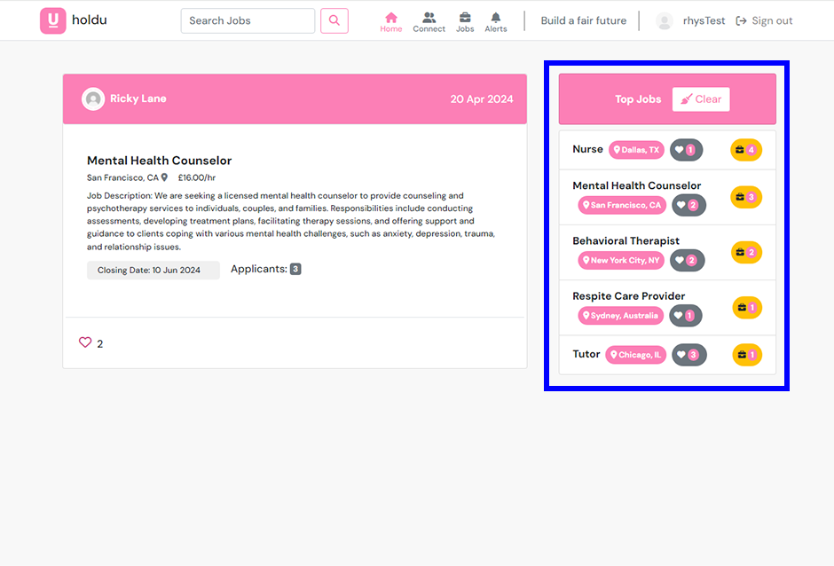
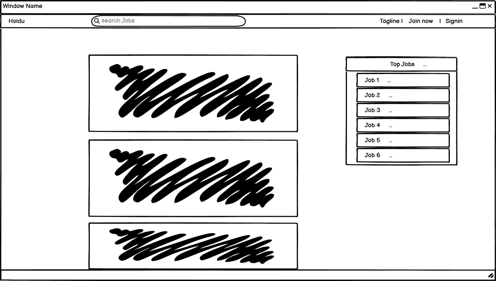

# Holdu
## React FrontEnd: Job Application Platform

*The deployed application link can be found here: [Holdu](https://hold-u-c52c62c74dca.herokuapp.com/)*

*Backend repository link can be found here: [link](https://github.com/Ry-F3/holdu-drf-api)*

## Key Features:

 

#### **Employer Profile Overview:**

The Employer Profile provides a comprehensive set of tools and features tailored to the needs of employers. Below are the key features offered by the Employer Profile experience:

Key features of this profile type include:

- **Jobs Management Tool:**
  - Post, edit, and update job listings with ease.
  - View applicants for each job and make decisions to accept or reject them.

- **Profile Type Selection Form:**
  - Employ a customizable user form where users can select their profile type and provide relevant profile information tailored specifically for employer profiles.

- **Connection Management:**
  - Connect with other users and efficiently manage connections within the platform.

- **View Profile:**
  - Access detailed profiles of other users to view their ratings, activity, and profile details.
  - Edit profile details and upload profile images as needed.

- **Alerts and Management Tool:**
  - Receive and manage notifications and alerts related to connections, connection requests, new ratings, and new job listings.

 

#### **Employee Profile Overview:**

Originally intended for a more interactive experience, the Employee Profile Type had to be simplified to meet development time constraints. To align with the applicant model, users can apply and unapply for jobs, while employers can accept or reject their applications.

Key features of this profile type include:

- **Apply and Unapply:** Users can apply for jobs they're interested in and withdraw their applications if needed.

- **Like Job Adverts:** Employees can express interest in job listings by liking them.

- **Receive Alerts:** Stay informed about new job listings with alerts.

- **Connect and Rate Profiles:** Connect with other users and rate their profiles based on interactions.

While the current iteration provides basic functionality, future developments will include a management tool for employees to track and respond to their accepted applications, enhancing the overall user experience.

 

### **Mobile Design <code>profile_type="employer"</code>:** 

*Refer below to view the details and screenshots for the employer profiles mobile design experience.*

 

Workflow board [1]

Details [1]

 

* **User Authentication:**
    * Unauthenticated users are directed to the home page where they can browse job listings.
    * To interact with job listings, users must either join or sign in if they are returning users.
* **Navigation Bar:**
    * The navigation bar provides easy access for users to search for jobs.
* **Form Validation:**
    * The forms for joining and signing in have validation mechanisms in place.
    * These validation features are similar to those demonstrated in the walkthrough project.
    * Code for form validation has been reused, ensuring consistency and reliability.
* **Customized Form:**
    * The form includes a field prompting users to specify what they are looking for, providing insight into their preferences.
    * Note that while a custom Django login was not implemented, this feature emphasises the applications intention regarding the site's content.
* **Simplistic Design:**
    * The design incorporates simplistic colors inspired by the logo, enhancing visual coherence and brand identity.

Workflow board [2]

Details [2]

 

* **User Authentication:**
  * Upon signing in for the first time after joining, users are directed to a form where they must fill out their details and specify what they are looking for, determining their profile_type.
  * To interact with the platform's features, users are required to join or sign in, catering to both new and returning users.

* **Navigation Bar:**
   * The bottom navigation features active colors to indicate the current page, enhancing user navigation and experience.
   * Users can navigate to the connections page by clicking on the connection icon.
   * On the connections page, users can send connections and view other profiles, with tabs to manage their pending and sent connections.

* **Form Validation:**
  * Forms for user registration and profile setup incorporate validation mechanisms to ensure accurate data entry and a smooth user experience.
  * These validation features align with industry standards and best practices, similar to those demonstrated in the walkthrough project.
  * On the home page, there is a validation mechanism to prevent the owner from liking their own posts.

* **Customized Form:**
  * During profile setup, users are prompted to specify what they are looking for, shaping their profile_type within the platform.
  * Please note that development focus has primarily been on the employer profile type to meet project timelines.

Workflow board [3]

Details [3]

 

* **Jobs Page Navigation**:
    * Users can navigate to the jobs page where they can view their open and closed listings.
    * Active listings are marked with a teal green tick, while closed listings display a red cross next to the open date.

* **Job Management**:
    * Once a job listing is closed, users have the option to accept or reject applicants.
    * Accepted applicants are stored in a designated "Accepted" folder for easy reference.

* **Filter Toggle**:
    * Users can toggle the filter to view and post jobs using the "Post Job Advert" form.
    * The form validates user data and displays Bootstrap alerts and warnings for improved user experience.

* **Edit Functionality**:
    * Users can click the "Edit" button on active listings to open a pop-up form and make edits to their job listings.

Workflow board [4]

Details [4]

 

* **Applicant Panel**:
    * On active listings, users can dropdown a panel to view the applicants for each job.
    * Clicking on the filter toggle cycles through the active and inactive listings. However, there are known bugs affecting the functionality. The issue may be attributed to a key error or data communication problem between the child and parent components.

* **Profile Page Navigation**:
    * Navigating to the profile page, users can view their profile type badge, average_rating, and connection count.
    * Users can also view and cycle through individual reviews.

* **Activity Panel**:
    * An activity panel has been implemented on the users profile to record employer profile type activities such as listing jobs. However, it is currently in a basic state and will be part of future development.

* **Profile Information Editing**:
    * Users can edit their profile information by clicking on the ellipsis icon.

* **Bug Explaination**:
    * When filtering through active and inactive job listings, applicants remain in their original positions on the page, while the data associated with the listings changes positions. This leads to a discrepancy where applicants appear to be attached to the wrong jobs or remain unaffected by the filtering action.

Workflow board [5]

Details [5]

 

* **Navigation to Alerts Icon:** 
    * Users can navigate to the alerts icon to view their notifications for connections, connection requests, new ratings, and new jobs. The labels are clearly displayed at the top in a small panel to inform the user.

* **Alert Types:** 
    * Please note that there are currently no alerts for applicants applying to the user's jobs. This feature will be added in future developments as it was overlooked during initial implementation. However, the applicant count is clearly defined on the job management page.

* **Alert Deletion:**
  * **Single Alert Deletion:** If the user clicks the delete icon without selecting an alert, a warning message will prompt the user to select at least one alert.
  * **Bulk Alert Deletion:** Clicking the tick icon will select all alerts, allowing the user to delete them all at once.
  * **Empty Alerts Notification:** Once all alerts are deleted, the user will be notified that their alerts are empty.

 

### **Mobile Design <code>profile_type="employee"</code>:** 

*Refer below to view the details and screenshots for the employee profiles mobile design experience.*

 

 

**Authentication:**
  - Users must be authenticated with the employee profile type to have a different setup for the navigation icons.

  **Navigation Setup:**
  - The JobsPost file runs a check to see whether the user is an employee.
  - If the user is authenticated as an employee, the file displays the buttons for applying and unapplying for jobs.

 

### **Desktop Design Differences:**

 

Desktop [1]

Details [1]

 

* Please be aware that while the design layout code was borrowed from the Code Institute walkthrough project, an image was sourced from [Storyset](https://storyset.com/illustration) to suit the application. I utilized Photoshop to edit the image, to ensure color consistency with my application.

Desktop [2]

Details [2]

 

* The desktop view of the home page features a sidebar that analyzes the top jobs with the most applicants. It identifies the top 6 jobs based on the number of applicants. Clicking on any of these jobs filters the job listings for the user, allowing them to apply if they are an employee <code>profile_type</code>.

Desktop [3]

Details [3]

 

* Clicking on the user's profile icon in the navbar will direct them to their profile page. The profile page features a sidebar, allowing the owner to easily navigate to their connections' profile pages.

Desktop [4]

Details [4]

 

* The rating form is located in the sidebar when viewing another user's profile page. If the user has more than three reviews, a horizontal review carousel is automatically activated, allowing for seamless navigation through the reviews.

 

## Wireframes

### Website Design Planning with Balsamiq

Balsamiq was used to construct a basic plan for the design of the website. Note that it is mostly in line with the walkthrough project as I wanted to concentrate on exploring my jobs and applicant complex model design.

[Learn more about Balsamiq](https://balsamiq.com/)

 

Wireframe 1

 

Wireframe 2

 

Wireframe 3

 

Wireframe 4

 

Wireframe 5

 

Wireframe 6

 

Wireframe 7

 

Wireframe 8

 

Wireframe 9

 

 

## User Stories 

#### Section 1

 

| #   | User Story                                                                                                      | Completed |
|-----|-----------------------------------------------------------------------------------------------------------------|-----------|
| [**#1**](https://github.com/Ry-F3/holdu/issues/1)   | As a new user, I want to be able to sign up for an account by providing my email, username, and password.      |    ✅     |
| [**#2**](https://github.com/Ry-F3/holdu/issues/2)   | If I already have an account, I should be notified that the chosen username or email is already in use.       |    ✅     |
| [**#3**](https://github.com/Ry-F3/holdu/issues/3)    | As a registered user, I want to log in to my account using my username/email and password.                     |    ✅     |
| [**#4**](https://github.com/Ry-F3/holdu/issues/4)    | As a user I would like to pick my profile type when registering.                                                |  ✅          |
| [**#5**](https://github.com/Ry-F3/holdu/issues/5)    | If my credentials are incorrect, I should receive an error message prompting me to try again.                  |      ✅      |
| [**#6**](https://github.com/Ry-F3/holdu/issues/6)    | Upon successful login, I should be redirected to the dashboard.                                                 |     ✅       |
| [**#7**](https://github.com/Ry-F3/holdu/issues/7)    | As a user, I want a top navigation bar with links to different sections of the application such as Home, Profile, Notifications, Messages, etc. |  ✅   |
| [**#8**](https://github.com/Ry-F3/holdu/issues/8)    | The navigation bar should also include options for logging out and accessing settings.                         |    ✅     |
| [**#9**](https://github.com/Ry-F3/holdu/issues/9)    | As a user on mobile devices, I want a bottom navigation bar for easy access to different sections of the application. |     ✅   |
| [**#10**](https://github.com/Ry-F3/holdu/issues/10)   | The bottom navigation should include icons or labels for Home, Profile, Notifications, Messages, etc.          |    ✅    |

 

#### Section 2

| #   | User Story                                                                                                                                           | Completed |
|-----|------------------------------------------------------------------------------------------------------------------------------------------------------|-----------|
| [**#12**](https://github.com/Ry-F3/holdu/issues/12)   | As a user, I want to browse through available job listings.                                                                                          |    ✅     |
| [**#13**](https://github.com/Ry-F3/holdu/issues/13)   | As an Employer user I should be able to post adverts with details such as job title, company name, location, and a brief description.                |    ✅     |
| [**#14**](https://github.com/Ry-F3/holdu/issues/14)   | As an Employer user, I want to be able to manage my job listings.                                                                                     |    ✅     |
| [**#15**](https://github.com/Ry-F3/holdu/issues/15)   | As an Employee user, I want to be able to apply for jobs that interest me.                                                                            |    ✅     |
| [**#16**](https://github.com/Ry-F3/holdu/issues/16)   | As an Employee user, I want to be able to track the status of my job applications.                                                                    |    ❌     |
| [**#17**](https://github.com/Ry-F3/holdu/issues/17)   | As an employer, I want to be able to respond to job applications.                                                                                     |    ✅     |
| [**#18**](https://github.com/Ry-F3/holdu/issues/18)   | As a user, I want to view my profile information including name, profile type, content, image.                                                        |    ✅     |
| [**#19**](https://github.com/Ry-F3/holdu/issues/19)   | If I'm an employee, I should be able to add/edit my work experiences.                                                                                 |    ❌     |
| [**#20**](https://github.com/Ry-F3/holdu/issues/20)   | As a user I want to be able to rate other users and view their ratings.                                                                               |    ✅     |

 

#### Section 3

| #   | User Story                                                                                                                                           | Completed |
|-----|------------------------------------------------------------------------------------------------------------------------------------------------------|-----------|
| [**#21**](https://github.com/Ry-F3/holdu/issues/21)  | As a user, I want to have control over the connections I establish on the platform.                                                                 |    ✅     |
| [**#22**](https://github.com/Ry-F3/holdu/issues/22)   | I should be able to view pending connection requests and manage them accordingly.                                                                    |    ✅     |
| [**#23**](https://github.com/Ry-F3/holdu/issues/23)   | As a user, I want to be able to view the connection requests I've sent to other users.                                                              |    ✅     |
| [**#24**](https://github.com/Ry-F3/holdu/issues/24)   | As a user, I want a centralized dashboard to manage all my connections.                                                                              |    ✅     |
| [**#25**](https://github.com/Ry-F3/holdu/issues/25)   | As a user, I want to receive notifications for connection requests, job alerts, accepted applications, message alerts, and new ratings.            |     ✅ / ❌     |
| [**#26**](https://github.com/Ry-F3/holdu/issues/26)   | I should be able to mark notifications as read or delete them.                                                                                        |    ✅ / ❌     |

 

#### Section 4

| #   | User Story                                                                                                                                      | Completed |
|-----|-------------------------------------------------------------------------------------------------------------------------------------------------|-----------|
| [**#27**](https://github.com/Ry-F3/holdu/issues/27) | As a user, I want to be able to leave reviews on users' profile pages that contribute to their average rating.                                |    ✅     |
| [**#28**](https://github.com/Ry-F3/holdu/issues/28) | As a user, I want to be able to see the employer's activity on their profile page.                                                           |    ✅    |
| [**#29**](https://github.com/Ry-F3/holdu/issues/29) | As a user, I want to be able to see the number of connections on a profile page.                                                              |    ✅    |
| [**#30**](https://github.com/Ry-F3/holdu/issues/30) | As a user, I want to see a defining badge to know if a user is looking to work or looking to hire.                                           |    ✅     |

## Development Choices

 

| Used Models         | Description                                     |
|---------------------|-------------------------------------------------|
| User                | Model representing the user entity.            |
| Custom Profile      | Model representing custom user profiles.       |
| Connection          | Model representing connections between users.  |
| Rating              | Model representing ratings given by users.     |
| Job                 | Model representing job listings.                |
| Application         | Model representing job applications.            |
| Notification        | Model representing notifications for users.    |
| Like                | Model representing likes on certain entities.  |

| Unused Models       | Description                                     |
|---------------------|-------------------------------------------------|
| Chat                | Model representing chat conversations.         |
| Message             | Model representing individual chat messages.   |
| Experience          | Model representing user work experiences.      |
| Comment             | Model representing comments on entities.       |

 

### Exploring the Remaining models in Future Development

The unused models, including Chat, Message, Experience, and Comment, will be explored in future development plans to enhance the product and broaden the application's use case. These models represent features such as chat conversations, individual chat messages, user work experiences, and comments on entities within the application. Integrating these features will enrich the user experience and provide additional functionality, ultimately improving engagement and expanding the application's capabilities.

 

## File Tree

 

src
│
└── components
    │
    ├── connections
    │   ├── ConnectionsTab.jsx
    │   ├── PendingTab.jsx
    │   ├── RecentProfiles.jsx
    │   └── SenttTab.jsx
    │
    ├── jobs
    │   ├── ApplicantFilteredItem.jsx
    │   ├── ApplicantItem.jsx
    │   ├── ApprovedApplicantItem.jsx
    │   ├── JobListItem.jsx
    │   ├── JobPostHomeItem.jsx
    │   └── TopJobs.jsx
    │
    ├── miscellaneous
    │   ├── DummyApplicantBox.jsx
    │   └── DummyBoxes.jsx
    │
    ├── navigation
    │   ├── NavBar.jsx
    │   ├── LoggedOutLogo.jsx
    │   ├── LggedOutIcons.jsx
    │   ├── LoggedInLogo.jsx
    │   ├── LoggedInEmployerIconsBottom.jsx
    │   ├── LoggedInEmployeeIcons.jsx
    │   ├── LoggedInEmployerIcons.jsx
    │   ├── LoggedInEmployeeIconsBottom.jsx
    │   └── BottomNavBar.jsx
    │
    ├── profile
    │   ├── ProfileBadges.jsx
    │   ├── ProfileHeader.jsx
    │   ├── activity
    │   │   ├── Acctivity.jsx
    │   │   └── RatingContent.jsx
    │   └── ratings
    │       ├── HorizontalRatingList.jsx
    │       ├── RatingForm.jsx
    │       └── RatingNavigationButtons.jsx
    │
    └── Asset.jsx
    └── Avatar.jsx
    └── CustomToolTip.jsx
    └── Spinner.jsx

 

The folders within the <strong>components</strong> directory serve to establish a close relationship with the corresponding pages in the application. Each folder corresponds to a specific section or feature of the application, reflecting the organization of the pages and their functionalities.

* **connections**: Contains components related to interactions and networking functionalities.

* **jobs**: Hosts components essential for job-related functionalities, including job creation, browsing, and posting.

* **profiles**: Contains components related to user profiles, including profile creation and viewing.

* **navigation**: Holds components essential for navigation across the application.

 

pages
│
├── auth
│   ├── SignInForm.jsx
│   └── SignUpForm.jsx
│
├── connections
│   └── ConnectionsPage.jsx
│
├── jobs
│   ├── JobCreateForm.jsx
│   ├── JobsHomePage.jsx
│   ├── JobsPost.jsx
│   └── JobsPostPage.jsx
│
├── notifications
│   └── NotificationsPage.jsx
│
└── profiles
    ├── ProfileTypeChoiceForm.jsx
    └── ProfileViewPage.jsx

 

* **auth**: Contains components for user authentication, including sign-in and sign-up forms.

* **notifications**: Contains the NotificationsPage.jsx file. Please note that NotificationsPage.jsx is the only file not broken down into its components and will be developed further in the future.

* **profiles**: Houses files related to user profiles, including profile type choice and profile viewing functionalities.

* **jobs**: Hosts page files related to job functionalities, such as job creation, browsing, and posting.

In retrospect, the power of components is evident, particularly on the user's personal profile page where the ConnectionsTab component was reused and hosted on ProfileViewPage.js for the owner's profile. It may also be useful to consider implementing a clickable connections page, allowing users to see their connections' profiles more easily.

### Profile Model

### Rating Model

### Notification Model

### Like Model

### Comment Model

**Not Used**

### WorkExperience Model
**Not Used**

### Connection Model

### Chat Model
**Not Used**

### Message Model
**Not Used**

## Agile Methodology

 

During my development process, I experienced differing approaches between backend and frontend work, which were reflected in my utilization of the sprint boards.

The backend development proceeded smoothly, with a more concise approach and well-timed execution in line with the planning of user stories. The structured nature of backend tasks allowed for efficient progress tracking on the sprint boards, ensuring alignment with project goals and timely completion of objectives.

In contrast, frontend development presented more challenges, requiring a more fluid approach to address evolving requirements and complexities. The dynamic nature of frontend tasks necessitated frequent adjustments and iterations, making it challenging to adhere strictly to predefined sprint plans. As a result, the frontend sprint boards often saw more frequent updates and adaptations to accommodate changing needs and overcome hurdles encountered during development.

Overall, while backend work followed a more structured and predictable path facilitated by the sprint boards, frontend development demanded greater flexibility and adaptability to navigate the complexities inherent in building the user interface and ensuring a seamless user experience.

#### Sprint 1 (March - April 2024)

Sprint details

Description: A bit of a learning curve with React, and I have been humbled on many occasions. Unfortunately, I wasted a lot of time not realizing that the user context and the profile provider were the wrong way around in the index.js file. I kept getting unexpected data errors. Once fixed, the understanding came a little quicker.

[Board 1](https://github.com/users/Ry-F3/projects/6)

#### Sprint 2 (March - April 2024)

Sprint details

Description: Mostly focused on the jobs management tool and posting. Please note that due to the extended development time on this section, I left out 2 user stories: #16 and #19.

[Board 2](https://github.com/users/Ry-F3/projects/7)

#### Sprint 3 (March - April 2024)

Sprint details

Description: Mostly focused on utilizing the connections model and notifications. Please note that there are tick and cross, next to user stories #25 and #26 because they were half completed. Applicant notifications will be implemented in future developments.

[Board 3](https://github.com/users/Ry-F3/projects/8)

#### Sprint 4 (March - April 2024)

Sprint details

Description: Mostly focused on building the profile pages. This is in its most basic form and will need further expansion in future developments.

[Board 4](https://github.com/users/Ry-F3/projects/9)

## Technologies Used

### Frameworks and Libraries

### Key Packages

### Other Software

## Testing

### Manual Testing

| Test Case                | Expected Outcome                                                                                                                    | Actual Outcome                                                                                                                                                                                                                                                                                                   |
|--------------------------|-------------------------------------------------------------------------------------------------------------------------------------|-----------------------------------------------------------------------------------------------------------------------------------------------------------------------------------------------------------------------------------------------------------------------------------------------------------------|
| Join Now Button          | User clicks "Join Now" button and is taken to a view to fill out information. Form is validated to prevent errors. After joining, user is redirected to sign in.                            | User successfully clicks "Join Now" button, fills out information, and is redirected to sign in. Form validation prevents errors.                                                                                                                                                                          |
| Signing In               | Upon initial sign in, user enters details. If any errors occur, appropriate messages indicate the issue. User is then directed to sign up form if `is_signup_completed` is `false`. Sometimes directed to sign up form upon reload or initially. | User enters details during sign in. Error messages indicate issues if any. User is directed to sign up form if `is_signup_completed` is `false`. Occasionally, sign up form appears upon reload or initial login.                                                                                                                                                            |
| Profile Choice Form      | After selecting a profile option (hire or work), user is taken to the home page with appropriate icons for the chosen profile.   | User selects a profile option and is redirected to the home page with icons corresponding to the chosen profile.                                                                                                                                                                                              |
| Home Page                | Depending on user's profile (employer or employee), different options are available. User can apply for jobs (if employee) or like jobs (if employer or employee). Mobile view hides top jobs, while desktop view shows top jobs.           | User can interact with appropriate options based on profile. Top jobs visibility varies between mobile and desktop views. Clicking on user profile name redirects to their profile page.                                                                                                                                                                             |
| Connections Page         | User can navigate to connections page using navbar or bottom navigation. Connection requests must be confirmed. Tool to manage connections works dynamically. User can click on connections' names or search bar to view their profile page.   | User successfully navigates to connections page. Connection requests require confirmation. Connection management tool works as expected. Clicking on connections' names or search bar redirects to their profile page.                                                                                                                                              |
| Jobs Icon                | Employer profile can post job ads, which are fully validated. Employer can manage ads, view applicants, and approve/reject applicants for closed listings.                          | Employer posts job ads successfully. Ads are validated and prevent posting without required fields. Employer can manage ads and view applicants. Approving/rejecting applicants for closed listings functions, but applicant status remains unchanged unexpectedly.                                                                                             |
| Notifications Icon       | Notifications show incoming notifications appropriately. Employee sees new job listings, while employer and employee see new ratings, connection requests, and connections.            | Notifications display correctly based on user profile. Employee receives new job listings notifications. Employer and employee receive new ratings, connection requests, and connections notifications.                                                                                                                                                             |
| Profile Page             | User can see average rating and ratings. Connections are displayed with option to click or delete, updating connection badge. Employer sees job listing activity.                | User can view average rating and ratings. Connections are displayed with click or delete options, updating connection badge. Employer views job listing activity.                                                                                                                                                                                                      |
| Navigation Search Bar    | Search bar works on all pages and takes user to home page. Clear button sometimes requires two clicks to work.                                                                           | Search bar successfully navigates to home page. Clear button occasionally requires two clicks to work, needing investigation for future developments.                                                                                                                                                                                                                   |
 

### Automated Testing

 

#### My Testing Experience with ESLint

##### Issues Encountered:
1. **Initial Installation**: I faced some difficulties during the installation of ESLint. The correct command for installing ESLint with npm is <code>`npx install eslint --save-dev`</code>.

2. **File Type Selection**: Initially, I opted for JSX files for their compatibility with the built-in Prettier plugin. However, this decision led to compatibility issues with ESLint.

3. **Configuration Challenges**: Configuring ESLint to work with JSX syntax was a bit challenging. I had to ensure that ESLint was set up to lint both JavaScript and React files.

4. **Conversion to JS**: To address the issues with ESLint, I decided to convert all JSX files to JavaScript files to simplify linting.

5. **Running ESLint**: After configuring ESLint, I ran ESLint using the command <code>`npx eslint .`</code>  to identify and fix linting errors in my project.

6. **Error Detection**: ESLint detected various errors in my codebase, including missing React imports and props validation errors.

7. **Workspace Cleanup**: Due to issues with ESLint's auto-fix feature causing breaking errors in my application, I decided to discard the workspace where ESLint was used.

**Future Development**: Moving forward, I plan to address the identified errors below in future developments to enhance the code quality and maintainability of the project.

#### Summary:
Overall, my testing experience with ESLint involved troubleshooting installation issues, configuring ESLint for JSX syntax, converting file types, and identifying and addressing linting errors.

  
Eslint

  
<strong>Dropdown Selection:</strong> "Eslint Testing"

   

  

   
  
  | File                                                             | Line   | Error                                                                                         |
|------------------------------------------------------------------|--------|-----------------------------------------------------------------------------------------------|
| /workspace/holdu/src/App.js                                     | 32-72  | 'React' must be in scope when using JSX                                                      |
| /workspace/holdu/src/App.test.js                                | 5      | 'React' must be in scope when using JSX                                                      |
| /workspace/holdu/src/components/Asset.js                        | 6      | 'loading', 'src', 'message' are missing in props validation                                  |
| /workspace/holdu/src/components/Avatar.js                       | 5      | 'src', 'height', 'border' are missing in props validation                                    |
| /workspace/holdu/src/components/Spinner.js                      | 4      | 'size' is missing in props validation                                                        |
| /workspace/holdu/src/components/connections/ConnectionsTab.js   | 9, 14, 43, 50, 59  | Various props like 'connections', 'handleDeleteConnection', etc. are missing in props validation  |
| /workspace/holdu/src/components/connections/PendingTab.js       | 9, 12, 40, 47  | Various props like 'pendingConnections', 'handleAccept', 'handleDecline', etc. are missing in props validation  |
| /workspace/holdu/src/components/connections/RecentProfiles.js  | 9-17, 28, 34, 40, 46, 86  | Various props like 'activeTabProfiles', 'searchQuery', 'filteredProfiles', etc. are missing in props validation  |
| /workspace/holdu/src/components/connections/SentTab.js          | 9, 13, 42, 49  | Various props like 'connections', 'handleUnsend', etc. are missing in props validation  |
| /workspace/holdu/src/components/job/ApplicantItem.js            | 3, 11, 12, 16, 18, 22  | Various props like 'applicant', 'applicant.image', 'applicant.owner_username', etc. are missing in props validation  |
| /workspace/holdu/src/components/job/ApprovedApplicantItem.js   | 3, 12, 13, 17, 30, 36  | Various props like 'applicant', 'applicant.applicant', 'applicant.employee_acceptance_response', etc. are missing in props validation  |
| /workspace/holdu/src/components/job/JobAdListItem.js           | 16, 58, 61, 74, 99, 104, etc.  | Various props like 'ad', 'ad.job_listing_id', 'ad.closing_date', etc. are missing in props validation  |
| /workspace/holdu/src/components/job/JobPostHomeItem.js         | 6-11  | Various props like 'title', 'description', 'location', etc. are missing in props validation  |
| /workspace/holdu/src/components/job/TopJobs.js                 | 10-16  | Various props like 'popularJobs', 'handleJobClick', 'handleClearClick', etc. are missing in props validation  |
| /workspace/holdu/src/components/miscellaneous/DummyApplicantBox.js | 3  | 'index' is missing in props validation                                                      |
| /workspace/holdu/src/components/navigation/LoggedOutLogo.js    | 11-15  | 'React' must be in scope when using JSX                                                      |
| /workspace/holdu/src/components/navigation/NavBar.js           | 32  | 'handleSearch' is missing in props validation                                                |
| /workspace/holdu/src/components/profile/ProfileBadges.js       | 4, 25, 27, 30, 34  | Various props like 'profile', 'acceptedConnections', etc. are missing in props validation  |
| /workspace/holdu/src/components/profile/ProfileHeader.js       | 9-12, 18, 19, 23, 28, 42, etc.  | Various props like 'profile', 'currentUser', 'showRatingForm', etc. are missing in props validation  |
| /workspace/holdu/src/components/profile/activity/Activity.js   | 5, 11  | Various props like 'postCount', 'filteredJobsPost', etc. are missing in props validation  |
| /workspace/holdu/src/components/profile/rating/HorizontalRatingList.js | 4, 10  | Various props like 'ratings', 'currentIndex', etc. are missing in props validation  |
| /workspace/holdu/src/components/profile/rating/RatingContent.js | 3, 6  | Various props like 'ratings', 'currentIndex', 'handleStarClick', etc. are missing in props validation  |
| /workspace/holdu/src/components/profile/rating/RatingForm.js  | 7-12  | Various props like 'rating', 'handleStarClick', 'comment', etc. are missing in props validation  |
| /workspace/holdu/src/components/profile/rating/RatingNavigationButtons.js | 5  | 'prevRating', 'nextRating' are missing in props validation                                   |
| /workspace/holdu/src/contexts/CurrentUserContext.js            | 24, 175-177  | 'children', 'React' is missing in props validation                                           |
| /workspace/holdu/src/contexts/ProfileContext.js                | 13  | 'children' is missing in props validation                                                    |
| /workspace/holdu/src/index.js                                   | 11  | ReactDOM.render is deprecated since React 18.0.0, use createRoot instead                       |
| /workspace/holdu/src/pages/auth/SignInForm.js                  | 110  | `'` can be escaped with `&apos;`, `&lsquo;`, `&#39;`, `&rsquo;`                               |
| /workspace/holdu/src/pages/jobs/JobsCreateForm.js              | 25, 487  | 'searchQuery', 'fetchApplicants' are missing in props validation                              |
| /workspace/holdu/src/pages/jobs/JobsHomePage.js                | 20  | 'searchQuery' is missing in props validation                                                  |
| /workspace/holdu/src/pages/jobs/JobsPost.js                    | 14-27, 33, 35, 40, 163, 166, etc.  | Various props like 'job_listing_id', 'title', 'description', etc. are missing in props validation  |

  
Wave

  
<strong>Dropdown Selection:</strong> "Wave"

   

  
  
  
<strong>Issue Encountered:</strong> While attempting to test with "wave", the system encountered difficulties. Unfortunately, it did not allow access to other pages and consistently displayed the error message "Page Not Found."

 

### Bugs

 

| Component               | Known Bug                                                                                                                                         | Investigate | Solution                                                                                                          | Implementation                                                          |
|-------------------------|---------------------------------------------------------------------------------------------------------------------------------------------------|-------------|-------------------------------------------------------------------------------------------------------------------|--------------------------------------------------------------------------|
| ProfileViewPage.jsx     | Authentication errors. An ideal solution would be to create a new view for specific profile IDs where authentication is not needed as a list format. |             | Quick fix: Removed the authenticated permission class from the detail view, which seemed to solve the problem temporarily. | Profile view has not crashed again on further testing.                    |
| JobListItem.jsx         | Error code while fetching applicants. URL permissions are causing conflicts.                                                                        | Needs further investigation  | Trial removal of URL permissions caused recursive errors. Investigate and implement a solution to handle URL permissions effectively. | Error fetching applicants: Request failed with status code 400. Solutions will be found in further developments but seems to be causing no additional harm. Errors are present in the console.         |
| ProfileTypeChoiceForm.jsx | Implementation of a pop-up profile choice form on initial sign up was complex. Addition of a login count to prevent posting to a specific URL.    |             | Further solutions needed for a more efficient user experience. If pop-up box doesn't appear on joining, please reload the page.  | Pop-up profile choice form may not appear on initial sign-up. Reload page if necessary. |

#### Deployment Steps

## Bibliography

